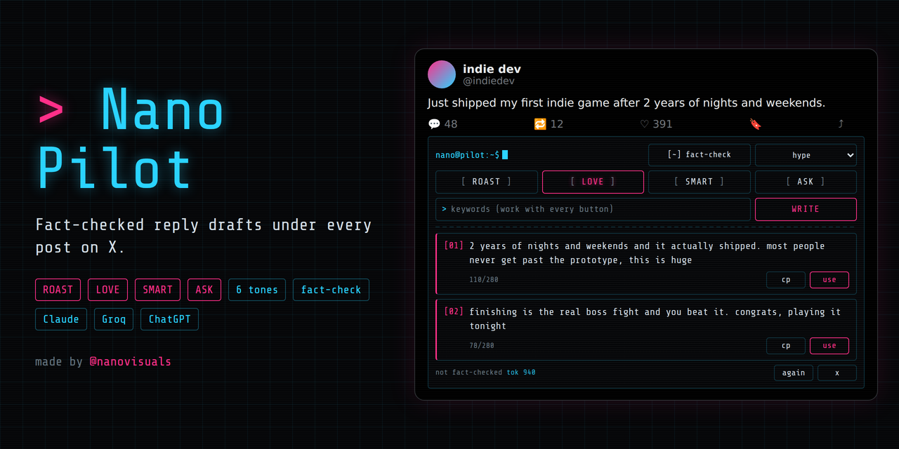
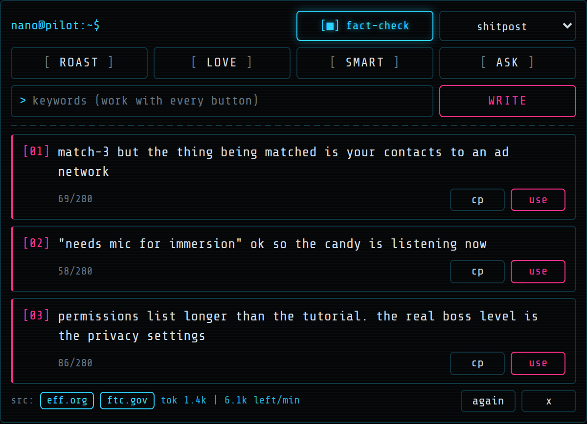
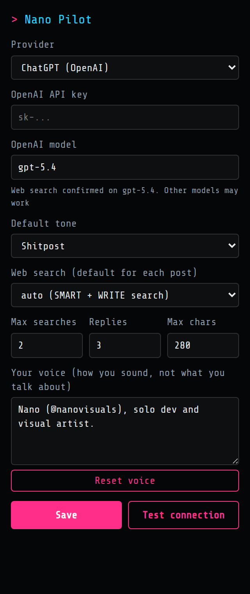
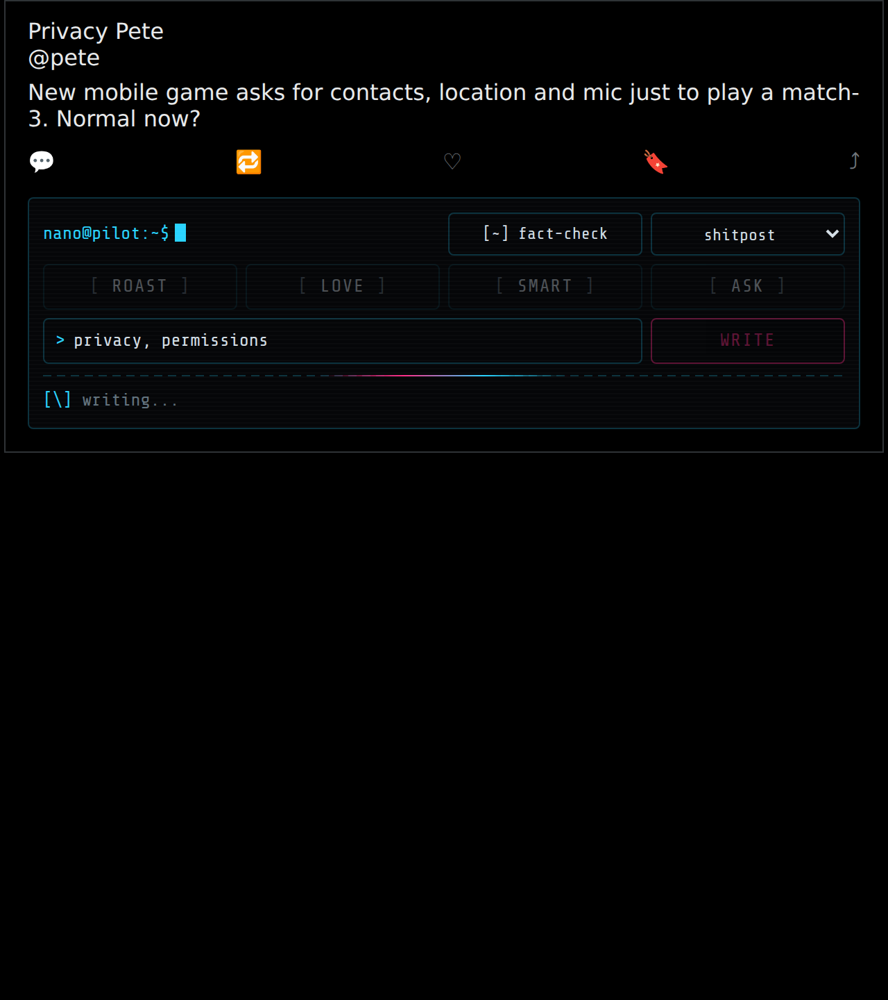
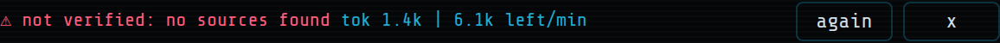

# Nano Pilot



**Fact-checked reply drafts under every post on X.**
A Chrome / Brave extension with a terminal look. Pick a style and a tone, and get 3 replies with source links. You still click Reply yourself.

Made by [@nanovisuals](https://x.com/nanovisuals). Free to use under the [MIT licence](LICENSE).



---

## Features

| | |
|---|---|
| **4 styles + WRITE** | ROAST, LOVE, SMART, ASK. Each has one job. Plus WRITE for your own keywords |
| **6 tones** | Dry, Shitpost, Hype, Savage, Chill, Builder |
| **Fact-check toggle** | Searches the web first and shows source links |
| **Not-verified warning** | Red warning if fact-check was on but no sources were found |
| **Keywords** | Typed keywords shape every button, not just WRITE |
| **3 AI providers** | Claude (Anthropic), Groq, or ChatGPT (OpenAI), using your own API key |
| **Token saver** | Cache (repeat click = 0 tokens), trimmed prompts, live token meter |
| **Rate-limit guard** | Auto-wait, then a backup model when Groq's free limit hits |
| **Never auto-posts** | It fills the reply box. You check it and click Reply |
| **Fully editable** | Every label, prompt, tone, model and selector lives in `config.js` |

---

## Install

1. Download this repo (**Code > Download ZIP**) and unzip it.
2. Open `chrome://extensions` (Brave: `brave://extensions`).
3. Turn on **Developer mode** (top right).
4. Click **Load unpacked** and pick the folder that has `manifest.json` in it.
5. Pin the extension from the puzzle icon.

## Set up

1. Click the extension icon.
2. Pick **Claude**, **Groq** or **ChatGPT** and paste your API key.
3. Click **Test connection**. It should say "Works".
4. Click **Save**, then refresh x.com.

| Provider | Get a key | Notes |
|---|---|---|
| Claude | [console.anthropic.com](https://console.anthropic.com) | Web search must be enabled for your organization in the Claude Console |
| Groq | [console.groq.com/keys](https://console.groq.com/keys) | Free tier available. Web search only works on GPT-OSS models (default `openai/gpt-oss-120b`) |
| ChatGPT (OpenAI) | [platform.openai.com/api-keys](https://platform.openai.com/api-keys) | Paid API, separate from a ChatGPT Plus subscription. Default model `gpt-5.4` (web search confirmed) |



---

## Use



1. Set the **fact-check** toggle and pick a **tone**.
2. Optional: type keywords in the `>` box.
3. Click **ROAST**, **LOVE**, **SMART**, **ASK**, or **WRITE**.
4. Check the source chips under the replies.
5. Click **use**. It opens the reply box and fills it. Read it, then click Reply.

### Fact-check toggle

| Button | Meaning |
|---|---|
| `[■] fact-check` (glowing) | ON: searches the web, shows sources |
| `[ ] fact-check` | OFF: no search, fast and cheap |
| `[~] fact-check` | Auto: only SMART and WRITE fact-check. One click turns it ON |

### Styles

Each button has **one job**: what the reply does to the reader.

| Style | Job | What it writes | Fact-check (auto) |
|---|---|---|---|
| ROAST | Make them **laugh** | Witty, sharp take on the idea. Never attacks identity | off |
| LOVE | Make them **feel good** | Genuine love. Names what's great and celebrates it | off |
| SMART | Make them **learn** | One real insight: fact, stat, mechanism or correction | **on** |
| ASK | Make them **reply** | One sharp question the author wants to answer | off |
| WRITE | Your angle | Built around the keywords you type | **on** |

Tones sit on top: LOVE + Hype, ROAST + Shitpost, SMART + Builder.

Add your own style in `config.js`. The bar grid resizes itself, so it stays symmetric.

### What the footer tells you

| You see | Meaning |
|---|---|
| `src: site.com` | Checked, with links |
|  | Fact-check was on but found nothing. Do not trust facts in it |
| `not fact-checked` | Toggle was off |
| `tok 1.4k \| 6.1k left/min` | Tokens used, and tokens left this minute (Groq and OpenAI) |

---

## Settings (popup)

| Setting | What it does |
|---|---|
| Provider | Claude, Groq or ChatGPT (OpenAI) |
| API key / model | Per provider. Keys are stored only in your browser |
| Default tone | Tone each new post starts with |
| Web search default | auto, on, or off for each new post |
| Max searches | Search cap per click (Claude) |
| Replies | How many options per click (1 to 5) |
| Max chars | Length limit per reply |
| Your voice | How replies sound. Not what they are about |
| Reset voice | Puts the default voice back |

---

## Groq free tier

At the time of writing (September 2026), Groq's free tier gives `openai/gpt-oss-120b` **8,000 tokens per minute** and **200,000 per day**, shared across your whole account. A fact-checked click can use a big part of one minute.

What the extension does about it:
1. Waits and retries when Groq asks for a short pause (up to 10s).
2. Switches to `openai/gpt-oss-20b`, which has its own separate limit.
3. Shows a clear message if both are maxed.

Tips: turn fact-check off for jokes, and use the cache. Groq's paid Dev Tier or a Claude key removes the problem.

---

## Which provider?

| | Claude | Groq | ChatGPT (OpenAI) |
|---|---|---|---|
| Cost | Paid | Free tier | Paid |
| Web search | Built-in web search tool | Browser Search (GPT-OSS models) | Responses API `web_search` |
| Limits | Your account tier | Small free per-minute limit | Your account tier |
| Best for | Quality replies | Trying it out for free | If you already use OpenAI |

---

## Customize

| File | Edit this for |
|---|---|
| `config.js` | Styles, tones, prompts, search defaults, models, rate-limit settings, OpenAI search size, X selectors, all UI words |
| `styles.css` | Colours, font, animations |
| `popup.html` / `popup.css` | Settings window |

After editing: `chrome://extensions` > reload icon > refresh X.

**If the bar stops showing,** X probably changed its page code. Update `selectors` in `config.js`.

---

## Files

```
nano-pilot/
├── manifest.json     Extension setup (Manifest V3)
├── config.js         All editable settings, prompts and labels
├── background.js     Calls Claude / Groq / OpenAI, parses replies and sources
├── content.js        The bar on x.com, inserting into the reply box
├── styles.css        Terminal look
├── popup.html/js/css Settings window
├── fonts/            Share Tech Mono + licence
├── icons/            Extension icons
├── docs/             Banner and screenshots for this README
└── LICENSE           MIT
```

---

## Privacy and safety

- **Your keys stay local.** They are saved in `chrome.storage.local` and only sent to the provider you pick.
- **Direct calls only.** The extension talks straight to `api.anthropic.com`, `api.groq.com` or `api.openai.com`. There is no middle server.
- **Permissions:** `storage`, plus access to x.com, twitter.com and the three API sites. Nothing else.
- **No auto-posting.** Automated replies break X's rules and can get an account suspended. This tool writes drafts and you post them.
- **Post text is data.** The prompt tells the AI to ignore any instructions hidden inside a post.
- **AI text is never run as HTML** on the page.

---

## Troubleshooting

| Problem | Fix |
|---|---|
| No bar under posts | Hard refresh (Ctrl/Cmd+Shift+R). Check the extension is on |
| "Extension was updated. Refresh this page." | Refresh x.com |
| "Add your API key..." | Open the popup, add the key, click Save |
| Groq "Rate limit reached" | Wait a minute, turn fact-check off, or upgrade |
| Replies drift to your own projects | Popup > **Reset voice** |
| "use" only copies | X's reply box didn't open in time. Paste with Ctrl/Cmd+V |
| "OpenAI stopped early" | Raise `openai.maxTokens` in `config.js` |
| OpenAI "insufficient_quota" | Add billing credit at platform.openai.com |

---

## Credits

- Font: [Share Tech Mono](https://fonts.google.com/specimen/Share+Tech+Mono) by Carrois Type Design, SIL Open Font License 1.1 (`fonts/OFL.txt`).
- Made by Nano ([@nanovisuals](https://x.com/nanovisuals)).
- Licence: [MIT](LICENSE). Free to use, change and share. Keep the credit.

See [CHANGELOG.md](CHANGELOG.md) for version history.
